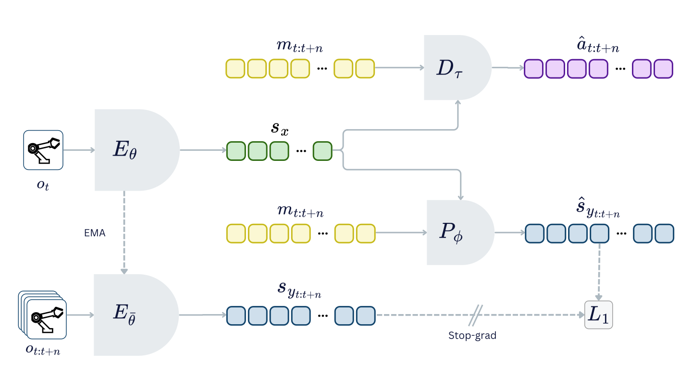

# ACT-JEPA: Novel Joint-Embedding Predictive Architecture for Efficient Policy Representation Learning

[[Paper]](https://arxiv.org/abs/2501.14622) [[Code]](https://github.com/act-jepa/act-jepa) [[Project Website]](https://act-jepa.github.io/)

ACT-JEPA is an architecture designed to improve action prediction and world model understanding. The model learns to generate executable actions using IL, while simultaneously learning a latent world model using JEPA. The world model is developed by learning to predict future states in latent space, allowing the model to focus on high-level semantic information instead of irrelevant details. This approach enables efficient learning, develops a robust world model, and improves action prediction.



## Quickstart

For a compact walkthrough of the ACT-JEPA architecture and tensor flow, start with [`act_jepa_illustrated.ipynb`](act_jepa_illustrated.ipynb).

The core ACT-JEPA/ACT-LEJEPA implementation is in [`models/act_jepa.py`](models/act_jepa.py#L233).
Baseline ACT-JEPA configs are in `configs/{environment}/act-jepa.yaml`, and
ACT-LEJEPA comparison configs are in `configs/{environment}/act-lejepa.yaml`.

## Repository Structure

```text
configs/           Training configs grouped by environment and model.
custom_envs/       Gymnasium wrappers and custom environment registration.
models/            ACT-JEPA, ACT, autoregressive transformer, and probes.
robo_utils/        Dataset, rollout, callback, and utility code.
scripts/           Training, evaluation, data-collection, and experiment runners.
transformer_utils/ Transformer layers shared by the models.
```
## Installation

```bash
conda create -n act-jepa python=3.12
conda activate act-jepa
pip install -r requirements.txt
```

## Weights & Biases ロギング

学習コンフィグはデフォルトで W&B にログを送ります。挙動は `WANDB_MODE` で
切り替えます。`online` は W&B にアップロード（`wandb login` または
`WANDB_API_KEY` が必要）、`offline` はログイン不要でローカルの `wandb/`
ディレクトリに保存のみ、`disabled` はロギングを完全に無効化します。
デフォルト値は `.env` に設定し（`.env.example` を参照）、実行時はシェルの
環境変数で上書きできます（シェル側が `.env` より優先されます）:

```bash
WANDB_MODE=offline python -m scripts.train --config_path configs/pusht/act-jepa.yaml
```

オフラインで保存した run は、あとから `wandb sync wandb/offline-run-*` で
アップロードできます。

## Docker

Docker イメージはオフラインでの実験実行向けに設定されています。W&B は
インストール済みですが、デフォルトで `WANDB_MODE=offline` が設定されて
いるため、ログや動画はアップロードされずローカルの `wandb/` ディレクトリに
書き込まれます。コンテナ内からアップロードしたい場合は `docker run` に
`-e WANDB_MODE=online`（および `-e WANDB_API_KEY=...`）を渡してください。

イメージのビルド:

```bash
docker build -t act-jepa .
```

ローカルのログ・W&B ファイル・Hugging Face キャッシュをマウントして
ManiSkill を実行:

```bash
docker run --rm --gpus all -it \
  -v "$PWD/logs:/workspace/act-jepa/logs" \
  -v "$PWD/wandb:/workspace/act-jepa/wandb" \
  -v "${HF_HOME:-$HOME/.cache/huggingface}:/cache/huggingface" \
  act-jepa \
  python -m scripts.train --config_path configs/mani_skill/act-jepa.yaml
```

イメージは Hugging Face もデフォルトでオフラインモードになっています。
キャッシュが未取得の場合は、初回のみ `HF_HUB_OFFLINE=0`、
`TRANSFORMERS_OFFLINE=0`、`HF_DATASETS_OFFLINE=0` を付けて実行するか、
取得済みのキャッシュをマウントしてください。

## Training

Use `scripts.train` with any config in `configs/{environment}/{model}.yaml`:

```bash
python -m scripts.train --config_path configs/<environment>/<model>.yaml
```

For example, to train the baseline ACT-JEPA policy on Push-T use this:

```bash
python -m scripts.train --config_path configs/pusht/act-jepa.yaml
```

For CRANE-X7, train a single config the same way:

```bash
python -m scripts.train --config_path configs/crane_x7/act.yaml
python -m scripts.train --config_path configs/crane_x7/act-jepa.yaml
python -m scripts.train --config_path configs/crane_x7/act-lejepa.yaml
python -m scripts.train --config_path configs/crane_x7/lewm-bc.yaml
```

To train the ACT-LEJEPA comparison variant on Push-T use this:

```bash
python -m scripts.train --config_path configs/pusht/act-lejepa.yaml
```

`act-jepa.yaml` uses `ActJepaModel` and keeps the original ACT-JEPA target
encoder behavior: no gradient through the target encoder, with
`EmaUpdateCallback` updating it by EMA. `act-lejepa.yaml` uses `ActLejepaModel`
with `model.target_update: grad`, following the LeJEPA reference design
(`samples/le-wm-main`): the gradient-trained target encoder embeds each state
independently (no cross-timestep attention, no dropout in the target path),
the prediction objective uses L1 to match the ACT-JEPA comparison loss, and
SIGReg is applied to the target latents only. SIGReg projection settings live
under `model.sigreg`; loss scaling lives under `model.loss_weights`, including
`action`, `jepa`, `abstract`, `target_sigreg`, and `context_sigreg`.

Available environments are `pusht`, `metaworld`, `mani_skill`, and `crane_x7`.
Available model configs include `act`, `act-jepa`, `act-lejepa`,
`ar_transformer`, `state_predictor`, `action_predictor`, and CRANE-X7's
`lewm-bc`.

## Experiment Runners

The shell runners wrap `scripts.train` and `scripts.evaluate` for repeated
experiments. By default, `MODELS` is `act act-jepa act-lejepa`.

Run all default models for one environment:

```bash
scripts/run_pusht_experiments.sh
scripts/run_metaworld_experiments.sh
scripts/run_mani_skill_experiments.sh
scripts/run_crane_x7_experiments.sh
```

Run only selected models:

```bash
MODELS="act act-jepa" scripts/run_pusht_experiments.sh
MODELS=lewm-bc scripts/run_crane_x7_experiments.sh
```

Run every environment in sequence:

```bash
scripts/run_all_experiments.sh
```

Useful environment variables:

```bash
# train only, no standalone evaluation after training; this is the default
MODELS=lewm-bc scripts/run_crane_x7_experiments.sh

# evaluate only
RUN_TRAIN=0 RUN_EVAL=1 MODELS=act-jepa scripts/run_crane_x7_experiments.sh

# CRANE-X7 camera-view evaluation
RUN_TRAIN=0 RUN_EVAL=1 CAMERA_VIEWS=right,left,front \
  MODELS=act-jepa scripts/run_crane_x7_experiments.sh

# override the held-out seed used only by the final CRANE-X7 evaluation
RUN_TRAIN=0 RUN_EVAL=1 FINAL_EVAL_SEED=3000 \
  MODELS=act-jepa scripts/run_crane_x7_experiments.sh
```

Experiment runners default to `RUN_EVAL=0`, so they do not run the extra
standalone evaluation pass after training. Set `RUN_EVAL=1` when you want that
additional checkpoint evaluation. CRANE-X7 configs use `env.seed` for
training-time checkpoint selection and `env.final_eval_seed` for this standalone
final evaluation.

For low-VRAM `lewm-bc` runs, use a small per-device batch and gradient
accumulation, for example:

```yaml
training_arguments:
  per_device_train_batch_size: 4
  per_device_eval_batch_size: 4
  gradient_accumulation_steps: 32
```

This keeps the effective train batch at `4 * 32 = 128`, but uses much less VRAM
than `per_device_train_batch_size: 128`.

## Probe Training

Probe scripts are used to inspect what ACT-JEPA learns during training beyond the final rollout success rate.

### State Predictor

The state predictor freezes the learned encoder and trains a small head to reconstruct future state trajectories. This measures world-model understanding through RMSE and ATE.

```bash
python -m scripts.train_state_predictor \
  --config_path configs/pusht/state_predictor.yaml \
  --base_config_path configs/pusht/act-jepa.yaml
```

### Action Predictor

The action predictor reuses the JEPA-pretrained representation for action reconstruction. This tests whether latent dynamics learned from future-state prediction also transfer to control.

```bash
python -m scripts.train_action_predictor \
  --config_path configs/pusht/action_predictor.yaml
```

Equivalent probe configs are available under `configs/metaworld/` and `configs/mani_skill/`.

## Evaluation

Rollout evaluation is configured in the `env` section of each config and is usually run through `AgentEvaluatorCallback`.

You can also evaluate a trained checkpoint directly:

```bash
python -m scripts.evaluate --config_path configs/pusht/act-jepa.yaml
```

Pass `--checkpoint_path` to evaluate a specific checkpoint:

```bash
python -m scripts.evaluate \
  --config_path configs/pusht/act-jepa.yaml \
  --checkpoint_path path/to/model.safetensors
```

Important fields include:

- `rollout_steps`: evaluate every N training steps.
- `rollout_delay`: skip early rollouts.
- `num_episodes`: number of evaluation episodes.
- `env_names`: task names for multi-environment evaluation.
- `env_kwargs`: environment construction arguments.


## Datasets

Experiments use datasets hosted on Hugging Face:
[Push-T](https://huggingface.co/datasets/alek98/pusht),
[MetaWorld](https://huggingface.co/collections/alek98/metaworld), and
[ManiSkill](https://huggingface.co/collections/alek98/maniskill).
The datasets closely follow the LeRobot format for episode-indexed robotics data, expecting features such as:

- `observation.image`
- `observation.state`
- `action`
- `episode_index`
- `frame_index`
- `task_index`

### Custom Dataset

For custom data, use the same LeRobot-style features above, upload/cache it as a Hugging Face dataset, copy the closest config, and update:

```yaml
dataset:
  repo_ids: [your-username/dataset-name]
  revision: main       # or your dataset revision
  use_videos: true     # false if images are stored in parquet
  train_episodes_range: [0, 100]
  test_episodes_range: [100, 120]
```

### CRANE-X7 Data Collection

CRANE-X7 demonstrations are collected locally with the scripted expert in
`scripts/collect_crane_x7_data.py`. The defaults live in
`configs/crane_x7/defaults.yaml`.

```bash
scripts/collect_crane_x7_data.sh
```

The default collection config saves successful episodes to
`local/crane_x7_lift`:

```yaml
collection:
  repo_id: local/crane_x7_lift
  num_episodes: 60
  max_steps: 300
  keep_failures: false
  max_attempts_factor: 3
```

With the default `num_episodes: 60`, the training configs use:

```yaml
dataset:
  repo_ids:
    - local/crane_x7_lift
  train_episodes_range: [0, 50]
  test_episodes_range: [50, 60]
```

To collect more data without editing the defaults file, pass environment
variables to the shell wrapper:

```bash
NUM_EPISODES=120 scripts/collect_crane_x7_data.sh
```

After collecting 120 episodes, update each CRANE-X7 training config to use the
new split:

```yaml
train_episodes_range: [0, 100]
test_episodes_range: [100, 120]
```

Other useful collection overrides:

```bash
REPO_ID=local/crane_x7_lift_v2 NUM_EPISODES=120 scripts/collect_crane_x7_data.sh
CAMERA_VIEW=front scripts/collect_crane_x7_data.sh
SHOW_VIEWER=1 scripts/collect_crane_x7_data.sh
KEEP_FAILURES=1 scripts/collect_crane_x7_data.sh
```

The script retries failed attempts when `keep_failures` is false, up to
`num_episodes * max_attempts_factor`. At the end it prints the saved episode
count, frame count, and the suggested train/test episode ranges.


## Citation

```bibtex
@article{vujinovic2025actjepa,
  title   = {ACT-JEPA: Novel Joint-Embedding Predictive Architecture for Efficient Policy Representation Learning},
  author  = {Vujinovic, Aleksandar and Kovacevic, Aleksandar},
  journal = {arXiv preprint arXiv:2501.14622},
  year    = {2025}
}
```
